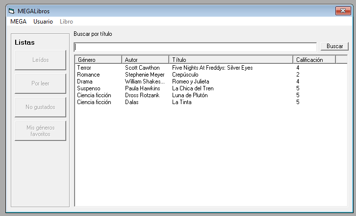
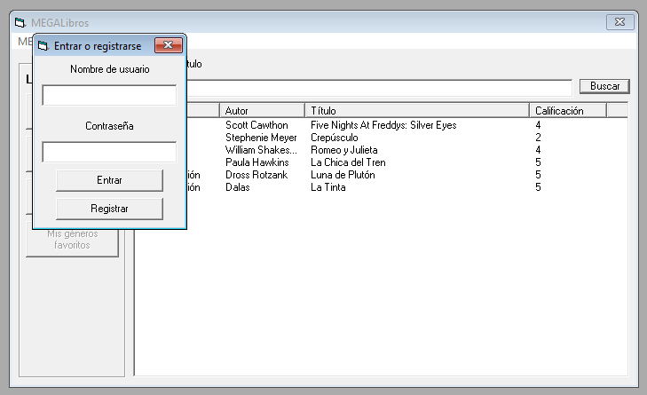
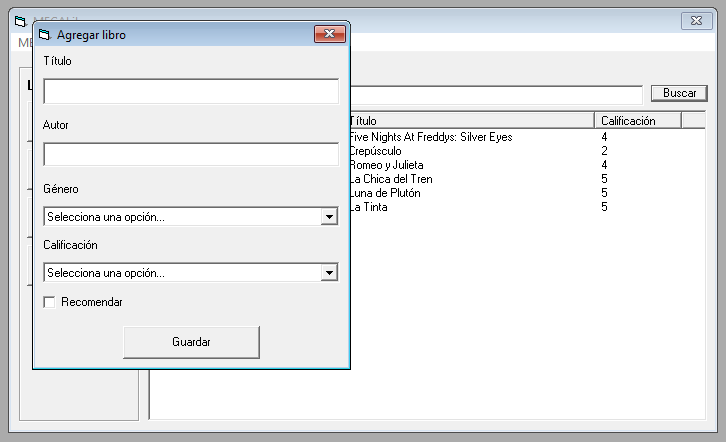
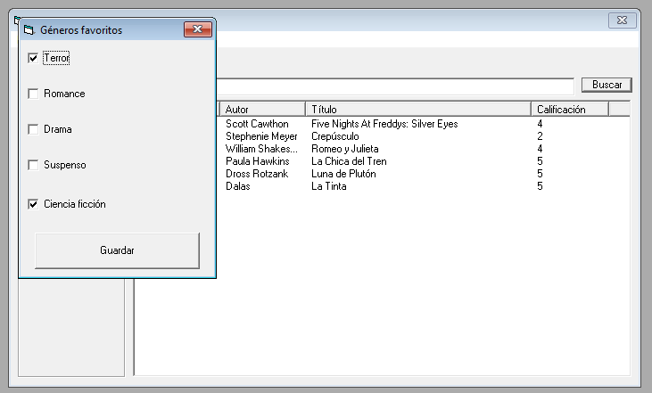
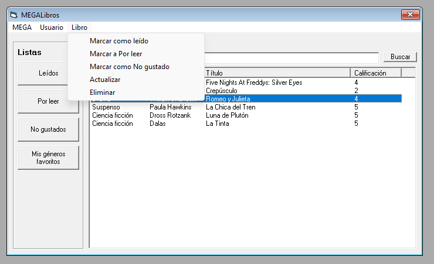

# MEGALibros

MEGALibros es un HUB de libros desarrollado en Visual Basic y SQL Server.

## Objetivo
Hacer un programa para Windows de un hub de entretenimiento con lo siguiere.
  - Catálogo de libros de MEGA.
  - Libros que ya leíste.
  - Libros que quieres leer.
  - Libros que no te gustaron.
  - Géneros favoritos.
  - Libros recomendados

Todo con SQL Server y Visual Basic 6.

## Nombre del desarrollador.
Aldo Kalid Hernández Camarena

## Imágenes del sistema en funcionamiento.

## ¿Cómo lo hice?
Inicié modelando la base de datos con un modelo ER y lo creé. Para el proyecto de Visual Basic, hice dos módulos: uno que se encarga de establecer la conexión con la base de datos y otro para el control de la sesión (este programa soporta inicio de sesión y registro de cuentas). Importé los componentes (ListView, ...) y librerías (ADODB) necesarias para trabajar este programa.

La interfaz contiene una tabla (donde se muestra el catálogo de libros) y una barra de botones laterales que sirven para filtrar el contenido de la tabla. En la barra superior, se encuentran herramientas adicionales que sirven para obtener todo el catálogo de MEGA, registrar un nuevo libro, iniciar o cerrar sesión, gestionar géneros favoritos y las herramientas para los libros (agregar o quitar de una lista, actualizarlo o eliminarlo).

## Modelo ER.

## Problemas conocidos.
No se reportaron problemas durante las pruebas del programa.

## Retrospectiva
### ¿Qué hice bien?
Como el programa implementa soporte multiusuario, tuve que implementar una estrategia para gestionar cómo los libros eran agregados y eliminados de ciertas listas. Esta estrategia se basa en arreglos de cadenas que almacenan el identificador del libro, si el libro está en la lista de leídos, si el libro está en la lista para leer o si el libro está en la lista de no gustados (ID|LL|LP|LN). Con esta información, pude controlar mejor cómo las opciones del botón "Libro" funcionan.

### ¿Qué no salió bien?
La instalación de Visual Basic fue absurdamente tedioso. Primero opté por utilizar una máquina virtual con Windows 7, y terminó siendo descartado porque SQL Server no tiene soporte para Windows 7 en versiones más nuevas. Luego me dí cuenta que no seguí los pasos de instalación al pie de la letra y, además, descubrí que la instalación debe hacerse con la cuenta de Administrador.

### ¿Qué puedo hacer diferente?
Parece que fuí muy distraído para los detalles del tutorial de instalación de VB. Debo prestar más atención a esto para evitar quedar estancado.
